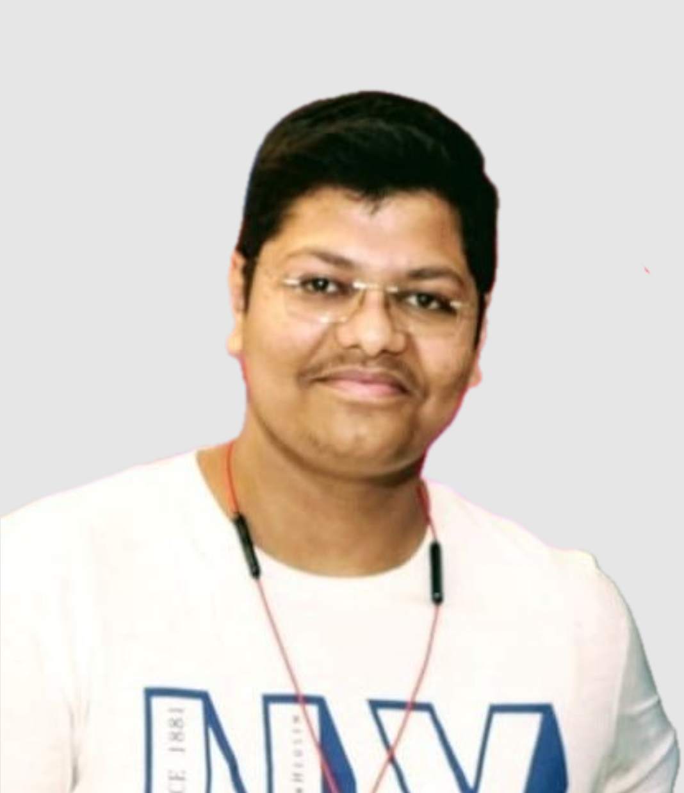
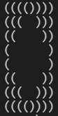
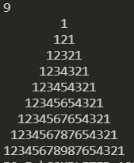
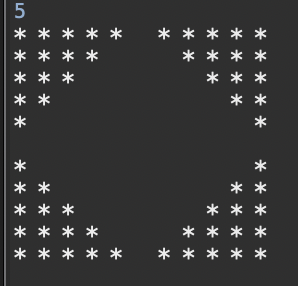
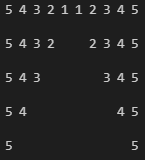
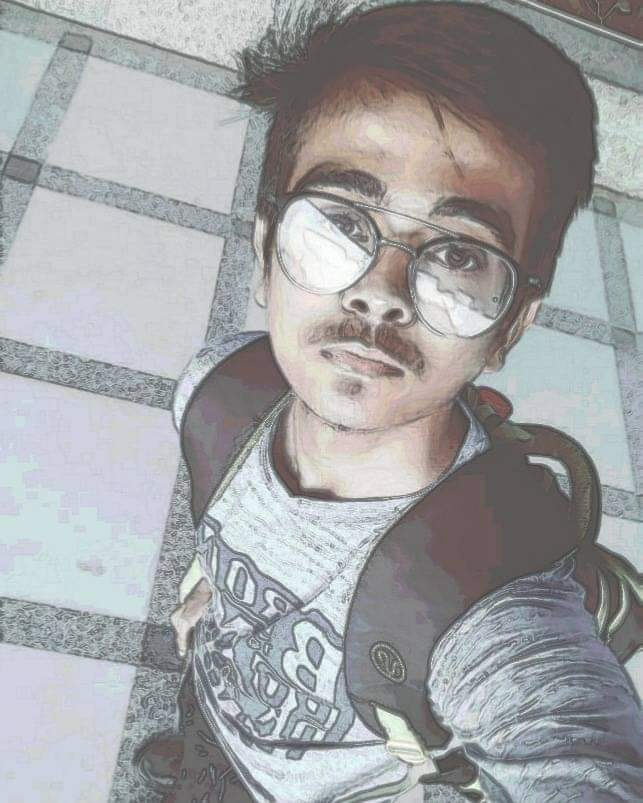
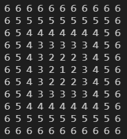
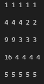
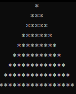

|Serial No.  |Name                    |GitHub UserName      |Photo                                                                      |Pattern File Name                 |Screenshot                                                                       |Institution                                          |Email Id                               |
|:----------:|:----------------------:|:-------------------:|:-------------------------------------------------------------------------:|:--------------------------------:|:-------------------------------------------------------------------------------:|:---------------------------------------------------:|:-------------------------------------:|
| |
|1           |Aritra Roy              |aritraroy24          |                          |aritraroy24.py                    |                   |Pondicherry University                               |aritraroy24@gmail.com                  |
|2           |Andrea Ortiz            |aortiz24             |                             |aortiz24.py                       |                      |University of Texas at Tyler                         |aortiz1865@gmail.com                   |
|3           |Paulo Amaral            |phfa26               |                               |phfa26.cpp                        |                        |AIT Academy of IT - Sydney, AU                       |paulo@amaral.com.au                    |
|4           |Priyansh Tripathi       |PriyanshTri          |                          |PriyanshTri.py                    |                   |GLA university                                       |priyanshtripathi007@gmail.com          |
|5           |Sayok Dey Majumder       |NeilSayok          |                          |NeilSayok.py                    |                   |University Of Engineering and Management, Kolkata                                       |sayokdeymajumder1998@gmail.com          |
|          |       |          |                 |NeilSayok.kt                   |                   |                           |   |
|6           |Himanshu Aggarwal       |Himanshu-Agg12          |                          |Himanshu-Agg12.cpp                    |                   |Chitkara University, HP                                       |aggarwal.himanshu2019@gmail.com          |
|7           |Tausiq Samantaray       |tausiq2003          | |tausiq2003.c                    |                   |Utkal University, OD                                       |tausiqsamantaray03@gmail.com    |
|8           |Pramdhanni Dwi Putra Bintang      |bimbims125         |                          |bimbims125.py                    |                   |Pelita Nusantara Vocatioan Highschool, INA                                       |pramvendread@gmail.com          |
|9           |Ankit Sangwan       |Sangwan5688          |                          |Sangwan5688.py                    |                   |BITS, Goa                                       |ankit.sangwan.5688@gmail.com          |
|10          |Wafa Rifqi Anafin       |wafarifki          |                          |wafarifki.js                    |                   |University Nusa Mandiri - Indonesia                                      |wafarifqianafin@gmail.com    |
|11          |Rami Janini             |janinirami          |                          |janinirami.py                    |                   |, OD                                       |janinirami@tutanota.com   |
|12          |Rohan Sharma     |rohansharma4050          |                          |rohansharma4050.py                    |                   |Amity University Mumbai                                       |rohansharma4050@gmail.com          |
|13          |Chirag Jain       |coderchirag          |                          |coderchirag.py                    |                   |University Chitkara University, Punjab - India                                      |chirag0174.be20@chitkara.edu.in                                   |
|14          |Smil Raj Thakur       |smil-thakur          |                          |smil-thakur.c                    |                   |Adani Institute Of Ifrastructure Engineering-India                                      |smil.raj.thakur@gmail.com    |
|15          |         Zina Youhan          |   zeenayouhan   |           |     Zina.java      |            |         University of Kelaniya, Sri Lanka         |     zinayouhan33@gmail.com      |
|16          |Agnibha Sarkar       |casafurix          |                          |casafurix.c                    |                   |Vishwakarma Institute Of Technology, Pune, India                                     |agnibha10@gmail.com    |
|          |       |          |                 |casafurix2.c                    |                   |                           |   |
|17          |Shreya Dayma            |ShreyaDayma-cse    |                       |ShreyaDayma-cse.java              |               |Amity University Kolkata                                     |shreyadayma0901@gmail.com         |
|18          |Kasun Hewagama       |KasunHewagama          |                          |KasunHewagama.js                    |                   |SLIIT - Sri Lanka                                      |kghewagama1997@gmail.com    |
|19          |Dulya Perera      |Dulyaaa        |                          |Dulyaaa.c                   |                   |Sri Lanka Institute of Information Technology |dulyakemali@gmail.com|
|20          |sai sumanth kumar       |saisumanthkumar    |                      |saisumanthkumar.py                |                   |Banaras Hindu University                                    |saisumanthkumar95509@gmail.com    |
|21          |Abhishek Gupta       |abhigpt401         |                          |abhigpt401.py                  |                   |Amity University                                     |abhigpt401@gmail.com  |
|22	     |Sreeja B.               |s-bh                |                                  |s-bh.java                         |				|IEM
|23         |Deepankar Varma       |deepankarvarma          |                          |deepankarvarma.cpp                    |                   |Thapar Institute of Engineering and Technology                                     |satwikdpshrit@gmail.com    |
|24     |     Prathamesh Kulkarni      |   hackto-dev    |      |   hackto-dev.py    |      |                  KLE Tech, Hubli                  | pratham.kulkarni1999@gmail.com  |
|25          |Shoray Singhal       |Shoray2002          |                          |Shoray2002.c                    |                   |Indian Institute of Information Technology, Lucknow                                      |lci2020037@iiitl.ac.in    |
|26           |Harsh Gupta       |Harshgupta5901          |                          |Harshgupta5901.c                    |                   |IIIT-Guwahati                                       |harshgupta5901@gmail.com          |
|27          |Arif Cahya Prananda       |boscahya          |                          |boscahya.py                    |                   |Dian Nuswantoro University - Indonesia                                      |boscahya@gmail.com    |
|28          |Arpan Mondal       |arp99          |                          |pattern.js                    |                   |Bengal Institute Of Technology, Kolkata                                     |arpan19991025@gmail.com    |
|29          |Anmol Pant       |anmolpant          |                          |anmolpant.java                    |                   |VIT, Vellore                                      |anmolpant@gmail.com    |
|30          |Prajjwal Pathak              |prajjwalpathak          |                          |prajjwalpathak.cpp                    |                   |Manipal University Jaipur                               |prajjwalpathak.asm@gmail.com                |
|31          |Nishiki Asumi Yapa       |Nishiki97          |                          |Nishiki97.ts  & Nishiki97.ts                  |                   |Sri Lanka Institute of Information Technology - Sri Lanka            |nishikiyapa1997@gmail.com    |
|32	     |Swapnil Narad	|Swapnilnarad2000		|                          |Swapnilnarad2000.cpp                    |                   |IIT, Bhilai                                       |swapniln@iitbhilai.ac.in          |
|33          |Anthony Rafael       |Anthony-Citizen          |                          |Anthony-Citizen.c                    |                   |Universitas Multimedia Nusantara - Indonesia                                      |anthony.rafael@student.umn.ac.id    |
|34          |Stevin Prince       |kemosabe2911          |                          |Kemosabe2911.py                    |                   |Mar Athanasius College of Engineering, Kothamanagalam                                      |stevinprince@gmail.com    |
|     35     |      Nandita Manchikanti      |    nandita-manchikanti    |      |    nandita-manchikanti.c    |      |        IIITDM Chennai - India        |    nandita.mvs10@gmail.com    |
|36          |Chathushka Rodrigo      |ChathushkaRodrigo        |                          |ChathushkaRodrigo.java                    |                   |Curtin S.L.I.I.T Sri Lanka                                     |chathushkarodrigo@gmail.com    |
|     37     |        Ankeeta Sahoo         |  sahooankeeta   |    |  sahooankeeta.cpp  |    |  Institute of Engineering and Management,Kolkata  |     sahooankeeta@gmail.com      |
|38          |Saikat Das       |saikatdgp2001          |                          |pascal triangle.c                   |                   |Kalinga Institute of Industrial Technology - Bhubaneswar                                      |saikatdgp2001@gmail.com    |
|     39     |        Arter Tendean         |   animemoeus    |      |   animemoeus.py    |      |                UNKLAB - Indonesia                 |        arter@animemoe.us        |
|40          |Moulik Agrawal       |moulikagrawal          |                          |moulikagrawal.java                   |                   |GGSIPU, New Delhi                                      |almoulik@gmail.com    |
|41          |Utkarsh Sharma       |U-c0de          |                          |U-c0de.cpp                    |                   |APJ Abdul Kalam Technical University                                      |utkarshplus@gmail.com    |
|42         | Kshitija Bharambe       |kshitija-2001          |                          |inverted- kshitija.c                    |                   |Ramrao Adik Institute of technology, Navi Mumbai                                    |bharambekshitija2@gmail.com   |
|43          |Somsubhra Das       |somsubhra1          |                          |somsubhra1.py                    |                   |University of Engineering & Management, Kolkata                                     |me@somsubhra.co    |
|44  |Anuj Khadka|Anuj-Khadka|| Anuj-Khadka.c| | CCRC, Nepal| anujkhadka008@gmail.com |
|45          |Pranendu Bikash Pradhan       |pbpcodes          |                          |pbpcodes.cpp                   |                   |IIIT Bhubaneswar, India                                      |pbpcodes@gmail.com    |
|46          |HARDIK SHARMA          |hardik302001          |                          |hardik302001.cpp                    |                   |Indian Institute of Information Technology, Sri City-India                                      |shardik2001@gmail.com    |
|47         |         Rishabh rathore          |   RishabhRathore055   |           |     rishabhrathore055.java      |            | Indore institute of science and technology     |     rishabhrathore055@gmail.com      |
|48          |Sarthak Roy       |sarthakroy2002          |                          |sarthakroy2002.c                    |                   |Amity University Kolkata-India                                      |sarthakroy2002@gmail.com    |
|49          |Tamojeet Kuila       |tamojeetK          |                          |tamojeetK.py                    |                   |Lovely Professional University - Punjab                                      |aahankuila@gmail.com    |
|50         |Sarisha Aggarwal      |Sarishaaggarwal          |                          |Sarishaaggarwal.cpp               |                   |Thapar University -Patiala |sarisha310703@gmail.com    |
|51         |Mansi V Jain       |Mansivjain00          |                          |Mansivjain00.java                    |                   |BMS College Of Engineering, Bangalore , India                                      |mansi.cs20@bmsce.ac.in    |
|52          |Abhay Kumar       |abhayxkumar          |                          |abhayxkumar.java                    |                   |GLA University - India                                      |singh.abhay1144@gmail.com    |
|53          | Ayush Tripathi |   ayush-t02   |           |     ayusht02.java      |            |  Vidyalankar Institute of Technology  |  tripathiayush23@gmail.com  |
|54          |         Ashutosh Krishna          |   ashutoshkrris   |           |     ashutoshkrris.py      |            |         Netaji Subhash Engineering College, Kolkata         |     ashutoshbritish@gmail.com      |
|55         |Krati Agrawal            |kraticodes    |                       |kraticodes.py              |               |Lakshmi Narain College Of technology, Bhopal                                     |krati1452001@gmail.com         |
|56          |         Vibhuti Jain          |   vibhuvj27   |           |     vibhuvj27.py      |            |         GGSIPU, India         |     vibhutijain99@gmail.com      |
|57          |         Preetam Das          |   Preetam-Das   |           |     Preetam-Das.py      |            |         Siliguri Institute of Technology, West Bengal, India         |     riki10112001@gmail.com      |
|58          |Mainak Debnath       |mainak-debnath         |                          |mainak-debnath.py                    |                   |St. Thomas' College Of Engineering & Technology - India                                  |debnath.mainak07@gmail.com
|59          |     Sarmistha Dash           |  Sarmi2709      |       |   Sarmi2709.py    |        |    Kalinga Institute of Industrial Technology,Odisha  |    1929171@kiit.ac.in  |
|60         |         Manas Bajpai          |   Manas0916   |           |     Manas0916.java      |            |         Ambalika Institute of Manaagement and Technology,Lucknow        |     manas.bajpai16@gamil.com      |
|61        |Xitiz Verma            |XitizVerma    |                       |XitizVerma.cpp              |               |Dayananda Sagar College of Engineering, Bangalore                                    |xitizverma@gmail.com         |
|62          |Shambashib Majumdar     |                 shambashib20|           |shambashib20.js                   |               |University of Engineering and Management Kolkata                          |shambashibmajumdar2000@gmail.com    
|63          |Prakhar Mishra        |prakhar3062          |     |prakhar3062.php           |            |Dr. B R Ambedakar National Insitute Of Technology   |prakharm.bt.20@nitj.ac.in         |
|64          |Satkar Acharya            |satkar2001    |                       |satkar2001.cpp              |               |VIT University,vellore                                   |satkaracharya883@gmail.com        |
|65          |Pritam Kundu            |warmachine028    |                       |warmachine028.kt              |               |University of Engineering and Management, Kolkata                                     |pritamkundu771@gmail.com         |
|66          |Udyan Singh             |Udyansingh         |                           |Udyansingh.cpp                    |                     |Vishwakarma Government Engineering College, India            |udyansingh07@gmail.com         |
|67          |Ashish Jaiswal           |Ash-ishJ    |                       |Ash-ishJ.cpp              |               |Lovely Professional University, Phagwara, Punjab                                    |ashish731824@gmail.com         |
|68          |Ayushi Rawat       |ayushi7rawat          |                          |ayushi7rawat.py                    |                   |RGPV, Bhopal, M.P.                                      |ayushi7rawat@gmail.com    |
|69          |Bhumik Varu     |bhumikvaru          |                          |bhumikvaru.cpp                    |                   |Kore Hyderabad                                       |bhumik97@gmail.com          |
|70          |Apoorva Kaushal            |ApoorvaKaushal09    |                       |ApoorvaKaushal09.java              |               |Banasthali Vidyapith Rajasthan                                     |apoorvakaushal93@gmail.com         |
|71          |Sanskriti Jain        |sans2001    |                       |sans2001.java              |               |Guru Gobind Singh Indraprastha University                                  |sanskritijain2001.2001@gmail.com         |
|          |       |          |                 |PascalTriangle.py                  |                   |                           |   |
|72      |Rahul Soni           |RahulSoni0    |                       |RahulSoni0.java              |               |National Institute Of Technology , Jamshedpur                                    |Rahul.kumar.soni2511@gmail.com         |
|73          |Prakhar Shukla           |prakharshukla48   | |    prakharshukla48.py   |  | SRM University     |  shuklaprakhar48@gmail.com   |         
|74          |Devsi Singh       |emily876          |                          |emily876.cpp                    |                   |CEC - Jhanjeri, Punjab                                     |grace.emily876@gmail.com    |
|75          |Agus Himawan           |Agushm    |                       |Agushm.dart              |               |Freelancer                                     |himawan.ags@gmail.com         |
|76          |Ishita Roy           |ISHITA-ROY016      |        |ISHITA-ROY016.java   |    | Academy Of Technology | royishita016@gmail.com   |
|77          |Dulaj Nadawa       |dnadawa                  |                          |dnadawa.py                    |                   |Informatics Institute of Technology - Sri Lanka                                      |dulajnadawa@gmail.com    |
|78           |Yash Jain              |yashjain1974          |                          |yashjain1974.c                    |                   |Jaypee Institute of information Technology,Noida                               |yash191174@gmail.com                  |
|79           |Tamal Bag            |tamalbag117     |                       |tamalbag117.java             |              |Academy Of Technology, Adisaptagram, India  |tamalbag107@gmail.com        |
|80          |Damarla Venkata Sai Chandana       |chandu6111         |                          |chandu6111.py                   |                   |G. Narayanamma Institute of Technology and Science for women                                      |dvs6112001@gmail.com    |
|81          |Keerthana Pravallika   | KeerthanaPravallika |  |KeerthanaPravallika.py     |  | G.Narayanamma Institute of Technology and Science  | keerthanapravallika@gmail.com
|82          |Sneha Mishra         |Medulla9991            |                          |Medulla9991.cpp                |                         |Veer Surendra Sai University of Technology, Odisha      |medulla9991@gmail.com      |
|83          |Vritika Malhotra       |VritikaMalhotra          |                          |VritikaMalhotra_Pattern.py                    |                   |L.J. Institute of Engineering and Technology, Ahmedabad                                     |vritikamalhotra23@gmail.com    |
|     84     |       Chaitanya Tekane       | chaitanyatekane |   | chaitanyatekane.java |  |    Sanjivani College of Engineering, Kopargaon     |    chaitanyatekne5@gmail.com    |
|85        |Indrahas Reddy Vennapusa      |Indrahas        |                          |Indrahas.py                    |                   |IITB                                      |ihreddy22@outlook.com    |
|86         |Sarthak Rajput       |rsarthak        |                          |rsarthak.cpp                    |                   |National Institute of Technology Hamirpur,HP                                      |sarthakr748@gmail.com    |
|87          |Shelendra Vashishtha       |shelendravashishtha2          |                          |shelendravashishtha2.py                    |                   |NIET                                     |shia.sharma123@gmail.com    |
|88            |avyay jain |       avyayjain.cpp||bmiet|avyay.jain@yahpp.in
|89         |Bhavika Tambi       |tambibhavika2000    |                      |tambibhavika2000.py                |                   |NIT SURAT                                    |tambibhavika2000@gmail.com   |
|     90     |     Chaudhary Hamdan      |   hamdan-codes    |      |   hamdan-codes.c    |      |                  KIIT University Bhubaneswar                  | ch.hamdan.edu@gmail.com  |
|91          |Param Pathak      |ParamPathak          |                          |smil-thakur.c                    |                   |Adani Institute Of Ifrastructure Engineering-India                                      |param.pathak07@gmail.com    |
|92      |Ritika Katoch           |Ritikakatoch0128        |                          |Ritikakatoch0128.java   |                   |Chitkara University                               |ritikaktoch0128@gmail.com                  |
|93      |Kartikeya Rawat           |kartikeya47        |                          |kartikeya47.py   |                   |VIT University                               |kartikeya.rawat2020@vitstudent.ac.in                  |
|94	     |Prakhar Srivastava |pyprakhar		|                          |pyprakhar.py                    |                   |Galgotias University                                      |srivastavaujjwal8@gmail.com          |
|95     |Sachin Raghuvanshi   |SachinRaghuvanshi2003         |   |SachinRaghuvanshi2003.py        |                   |Vellore Institute of technolgy, Vellore            |sachinrghvnsh@gmail.com    |
|96           |Rahul Naithani       |R-C0DE          |                          |R-C0DE.py                    |                   |APS Delhi Cantt, Delhi                                       |unvincible2003@gmail.com          |
|97          |Rebecca Elisabeth Falcao       |rebs-becca15          |                          |rebs-becca15.py                    |                   |Goa College of Engineering- Goa                                      |rebsfalcao15@gmail.com    |
|98	     |Harsh Kumar	|harsh2k2		|                          |harsh2k2.cpp                    |                   |TIET                                       |kumar_harsh@outlook.in          |
|99	     |Sourav Moyra	|souravmoyra		|                          |souravmoyra.cs                    |                   |Hyderabad University          |souravmoyra123@gmail.com          |
|99	     |Sourav Moyra	|souravmoyra		|                          |souravmoyra.cs                    |                   |Hyderabad University          |souravmoyra123@gmail.com          |
|100	 |Aaryan Gupta	|Aaryan0424| | Aaryan0424.c | |IIIT-Guwahati                                      |aaryangupta0424@gmail.com|
|101           |Madelene Campos         |Madelene         |                          |maddie.c                    |                   |University of Illinois Alumni                              |madelenecampos@gmail.com                  |
|102	     |Ritik Gupta	|hey-ritikgupta		|                          |hey-ritikgupta.cpp                    |                   |NIT, Delhi                                       |ritikgupta691@gmail.com         |
|     103     |      Panca Ragil     |    Opydipoy    |      |    opydipoy.py    |      |        INSPITECH - Inspirational Technology        |    pancaragilp33@gmail.com    |
|104	     |Hasti Suatria	|HastiSutaria	|                          |HastiSutaria.c                    |                   |Adani Institute Of Infrastructure, Ahmedabad                                      |hastisutaria.ict19@gmail.com |
|105         | Keder Nath Mallick |   keder-code-hash   |           |     keder-code-hash.py      |            |  Techno International Newtown  |  kedernath.mallick.tint00@gmail.com  |
|106          |Deepanshu        |Deepanshu276    |                       |Deepanshu276.java              |               |Guru Gobind Singh Indraprastha University                                  |kumardeepanshu1999@gmail.com         |
| 107         |       Manish Prajapati       |       pman47        |               |         pman47.cpp          |                      |       P.D Pandya Institute of Computer Applications        |   sureshprajapati470@gmail.com   |
|108     |Purnadip Manna	|purnadip-manna		|                          |purnadip-manna.py                 |                   |Techno International New Town                                       |purnadipmanna2702@gmail.com          |
|109          |Rahul Naithani       |R-C0DE          |                          |R-C0DE.py                    |                   |APS Delhi Cantt, Delhi                                       |unvincible2003@gmail.com          |
|110           |Khushi Prasad       |khushipr          |                          |khushipr.cpp                    |                   |TIET, Patiala                                      |khushipr01@gmail.com          |
|111      |Aman Ojha           |coderaman07        |                          |coderaman07.py   |                   |IMS Ghaziabad UC Campus, UP                               |coderaman07@gmail.com                  |
|112          |Kalp Patel              |                      kalp-77|           |kalp-77.cpp                       |                    |D.Y.Patil college of engineering, Akurdi, Pune                             |kalp07patel@gmail.com             |
|113          |Himanshu Malviya              |Himanshu664         |                          |Himanshu664.java                    |                   |SGSITS Indore                              |himanshumalviya100@gmail.com            |
|114	     |Tanmay Sharma     |Tanmay-s55          |		|Tanmay-s55.c		|		|Graphic Era University		|tanmayshr55@gmail.com
|115           |Abhi Tyagi              |abhityagi09          |                          |abhityagi09.py                    |                   |U.I.E.T. kurukshetra University                               |atyagi892@gmail.com      
|116           |Akshat kumar              |akshatkumar27         |                          |akshatkumar27.c                   |                   |jaypee university of information and technology                         |theyashgreat@gmail.com                  |
|117         | Keder Nath Mallick |   keder-code-hash   |           |     keder-code-hash.py      |            |  Techno International Newtown  |  kedernath.mallick.tint00@gmail.com  |
|118    | Arghya Sahoo | arghyasahoo |  | arghyasahoo.py |  | Techno International Newtown | arghyasahoo001@gmail.com |
|119          |Shalini Agrawal       |shaliniagrawal2512         |                          |shaliniagrawal2512.cpp                    |                   |IIIT Allahabad, UP                                     |shanuagrawal133@gmail.com    |
|120          |Adrija Roy       |adrija24         |                          |adrijaroy24.c                    |                   |BSTM, West Bengal                                     |24adrijaroy@gmail.com    |
