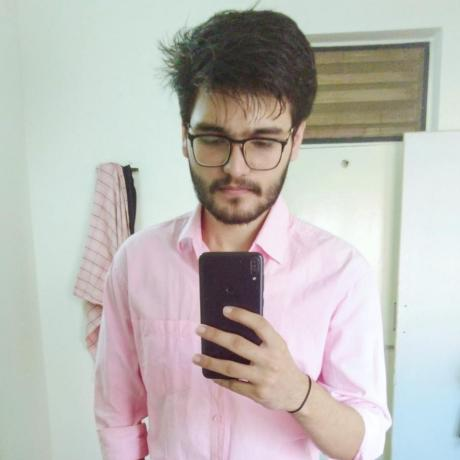
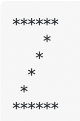
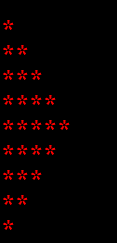
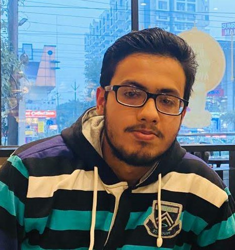

|Serial No.  |Name                    |GitHub UserName      |Photo                                                                      |Pattern File Name                 |Screenshot                                                                       |Institution                                          |Email Id                               |
|:----------:|:----------------------:|:-------------------:|:-------------------------------------------------------------------------:|:--------------------------------:|:-------------------------------------------------------------------------------:|:---------------------------------------------------:|:-------------------------------------:|
|1           |Aritra Roy              |aritraroy24          |                          |aritraroy24.py                    |                   |Pondicherry University                               |aritraroy24@gmail.com                  |
|2           |Andrea Ortiz            |aortiz24             |                             |aortiz24.py                       |                      |University of Texas at Tyler                         |aortiz1865@gmail.com                   |
|3           |Paulo Amaral            |phfa26               |                               |phfa26.cpp                        |                        |AIT Academy of IT - Sydney, AU                       |paulo@amaral.com.au                    |
|4           |Priyansh Tripathi       |PriyanshTri          |                          |PriyanshTri.py                    |                   |GLA university                                       |priyanshtripathi007@gmail.com          |
|5           |Sayok Dey Majumder       |NeilSayok          |                          |NeilSayok.py                    |                   |University Of Engineering and Management, Kolkata                                       |sayokdeymajumder1998@gmail.com          |
|          |       |          |                 |NeilSayok.kt                   |                   |                           |   |
|6           |Himanshu Aggarwal       |Himanshu-Agg12          |                          |Himanshu-Agg12.cpp                    |                   |Chitkara University, HP                                       |aggarwal.himanshu2019@gmail.com          |
|7           |Tausiq Samantaray       |tausiq2003          | |tausiq2003.c                    |                   |Utkal University, OD                                       |tausiqsamantaray03@gmail.com    |
|8           |Pramdhanni Dwi Putra Bintang      |bimbims125         |                          |bimbims125.py                    |                   |Pelita Nusantara Vocatioan Highschool, INA                                       |pramvendread@gmail.com          |
|9           |Ankit Sangwan       |Sangwan5688          |                          |Sangwan5688.py                    |                   |BITS, Goa                                       |ankit.sangwan.5688@gmail.com          |
|10          |Wafa Rifqi Anafin       |wafarifki          |                          |wafarifki.js                    |                   |University Nusa Mandiri - Indonesia                                      |wafarifqianafin@gmail.com    |
|11          |Rami Janini             |janinirami          |                          |janinirami.py                    |                   |, OD                                       |janinirami@tutanota.com   |
|12          |Rohan Sharma     |rohansharma4050          |                          |rohansharma4050.py                    |                   |Amity University Mumbai                                       |rohansharma4050@gmail.com          |
|13          |Chirag Jain       |coderchirag          |                          |coderchirag.py                    |                   |University Chitkara University, Punjab - India                                      |chirag0174.be20@chitkara.edu.in                                   |
|14          |Smil Raj Thakur       |smil-thakur          |                          |smil-thakur.c                    |                   |Adani Institute Of Ifrastructure Engineering-India                                      |smil.raj.thakur@gmail.com    |
|15          |         Zina Youhan          |   zeenayouhan   |           |     Zina.java      |            |         University of Kelaniya, Sri Lanka         |     zinayouhan33@gmail.com      |
|16          |Agnibha Sarkar       |casafurix          |                          |casafurix.c                    |                   |Vishwakarma Institute Of Technology, Pune, India                                     |agnibha10@gmail.com    |
|          |       |          |                 |casafurix2.c                    |                   |                           |   |
|17          |Shreya Dayma            |ShreyaDayma-cse    |                       |ShreyaDayma-cse.java              |               |Amity University Kolkata                                     |shreyadayma0901@gmail.com         |
|18          |Kasun Hewagama       |KasunHewagama          |                          |KasunHewagama.js                    |                   |SLIIT - Sri Lanka                                      |kghewagama1997@gmail.com    |
|19          |Dulya Perera      |Dulyaaa        |                          |Dulyaaa.c                   |                   |Sri Lanka Institute of Information Technology |dulyakemali@gmail.com|
|20          |sai sumanth kumar       |saisumanthkumar    |                      |saisumanthkumar.py                |                   |Banaras Hindu University                                    |saisumanthkumar95509@gmail.com    |
|21          |Abhishek Gupta       |abhigpt401         |                          |abhigpt401.py                  |                   |Amity University                                     |abhigpt401@gmail.com  |
|22	     |Sreeja B.               |s-bh                |                                  |s-bh.java                         |				|IEM
|     21     |        Aman Upadhyay         |  AmanxUpadhyay  |   |  AmanxUpadhyay.c   |   |                 Amity University                  |   amanupadhyay0208@gmail.com    |
|         |            |   |   |  AmanxUpadhyay1.c   |   |                                |    |
|22          |Aditya Singh Rathore       |adityasrathore          |                          |adityasrathore.cpp                    |                   |Thapar Institute Patiala                                   |adityasr2000@gmail.com    |
|23         |Deepankar Varma       |deepankarvarma          |                          |deepankarvarma.cpp                    |                   |Thapar Institute of Engineering and Technology                                     |satwikdpshrit@gmail.com    |
|     24     |     Prathamesh Kulkarni      |   hackto-dev    |      |   hackto-dev.py    |      |                  KLE Tech, Hubli                  | pratham.kulkarni1999@gmail.com  |
|25          |Shoray Singhal       |Shoray2002          |                          |Shoray2002.c                    |                   |Indian Institute of Information Technology, Lucknow                                      |lci2020037@iiitl.ac.in    |
|26           |Harsh Gupta       |Harshgupta5901          |                          |Harshgupta5901.c                    |                   |IIIT-Guwahati                                       |harshgupta5901@gmail.com          |
|27          |Arif Cahya Prananda       |boscahya          |                          |boscahya.py                    |                   |Dian Nuswantoro University - Indonesia                                      |boscahya@gmail.com    |
|28          |Arpan Mondal       |arp99          |                          |pattern.js                    |                   |Bengal Institute Of Technology, Kolkata                                     |arpan19991025@gmail.com    |
|29          |Anmol Pant       |anmolpant          |                          |anmolpant.java                    |                   |VIT, Vellore                                      |anmolpant@gmail.com    |
|30          |Prajjwal Pathak              |prajjwalpathak          |                          |prajjwalpathak.cpp                    |                   |Manipal University Jaipur                               |prajjwalpathak.asm@gmail.com                |
|31          |Nishiki Asumi Yapa       |Nishiki97          |                          |Nishiki97.ts  & Nishiki97.ts                  |                   |Sri Lanka Institute of Information Technology - Sri Lanka            |nishikiyapa1997@gmail.com    |
|32	     |Swapnil Narad	|Swapnilnarad2000		|                          |Swapnilnarad2000.cpp                    |                   |IIT, Bhilai                                       |swapniln@iitbhilai.ac.in          |
|33          |Anthony Rafael       |Anthony-Citizen          |                          |Anthony-Citizen.c                    |                   |Universitas Multimedia Nusantara - Indonesia                                      |anthony.rafael@student.umn.ac.id    |
|34          |Stevin Prince       |kemosabe2911          |                          |Kemosabe2911.py                    |                   |Mar Athanasius College of Engineering, Kothamanagalam                                      |stevinprince@gmail.com    |
|     35     |      Nandita Manchikanti      |    nandita-manchikanti    |      |    nandita-manchikanti.c    |      |        IIITDM Chennai - India        |    nandita.mvs10@gmail.com    |
|36          |Chathushka Rodrigo      |ChathushkaRodrigo        |                          |ChathushkaRodrigo.java                    |                   |Curtin S.L.I.I.T Sri Lanka                                     |chathushkarodrigo@gmail.com    |
|     37     |        Ankeeta Sahoo         |  sahooankeeta   |    |  sahooankeeta.cpp  |    |  Institute of Engineering and Management,Kolkata  |     sahooankeeta@gmail.com      |
|38          |Saikat Das       |saikatdgp2001          |                          |pascal triangle.c                   |                   |Kalinga Institute of Industrial Technology - Bhubaneswar                                      |saikatdgp2001@gmail.com    |
|     39     |        Arter Tendean         |   animemoeus    |      |   animemoeus.py    |      |                UNKLAB - Indonesia                 |        arter@animemoe.us        |
|40          |Moulik Agrawal       |moulikagrawal          |                          |moulikagrawal.java                   |                   |GGSIPU, New Delhi                                      |almoulik@gmail.com    |
|41          |Utkarsh Sharma       |U-c0de          |                          |U-c0de.cpp                    |                   |APJ Abdul Kalam Technical University                                      |utkarshplus@gmail.com    |
|42         | Kshitija Bharambe       |kshitija-2001          |                          |inverted- kshitija.c                    |                   |Ramrao Adik Institute of technology, Navi Mumbai                                    |bharambekshitija2@gmail.com   |
|43          |Somsubhra Das       |somsubhra1          |                          |somsubhra1.py                    |                   |University of Engineering & Management, Kolkata                                     |me@somsubhra.co    |
|44  |Anuj Khadka|Anuj-Khadka|| Anuj-Khadka.c| | CCRC, Nepal| anujkhadka008@gmail.com |
|45          |Pranendu Bikash Pradhan       |pbpcodes          |                          |pbpcodes.cpp                   |                   |IIIT Bhubaneswar, India                                      |pbpcodes@gmail.com    |
|46          |HARDIK SHARMA          |hardik302001          |                          |hardik302001.cpp                    |                   |Indian Institute of Information Technology, Sri City-India                                      |shardik2001@gmail.com    |
|47         |         Rishabh rathore          |   RishabhRathore055   |           |     rishabhrathore055.java      |            | Indore institute of science and technology     |     rishabhrathore055@gmail.com      |
|48          |Sarthak Roy       |sarthakroy2002          |                          |sarthakroy2002.c                    |                   |Amity University Kolkata-India                                      |sarthakroy2002@gmail.com    |
|49          |Tamojeet Kuila       |tamojeetK          |                          |tamojeetK.py                    |                   |Lovely Professional University - Punjab                                      |aahankuila@gmail.com    |
|50         |Sarisha Aggarwal      |Sarishaaggarwal          |                          |Sarishaaggarwal.cpp               |                   |Thapar University -Patiala |sarisha310703@gmail.com    |
|51         |Mansi V Jain       |Mansivjain00          |                          |Mansivjain00.java                    |                   |BMS College Of Engineering, Bangalore , India                                      |mansi.cs20@bmsce.ac.in    |
|52          |Abhay Kumar       |abhayxkumar          |                          |abhayxkumar.java                    |                   |GLA University - India                                      |singh.abhay1144@gmail.com    |
|53          | Ayush Tripathi |   ayush-t02   |           |     ayusht02.java      |            |  Vidyalankar Institute of Technology  |  tripathiayush23@gmail.com  |
|54          | Rohit Mahajan |   Rohitm619   |           |     Rohitm619.cpp      |            |  Sinhgad Academy of Engineering  |  adef32795@gmail.com  |
